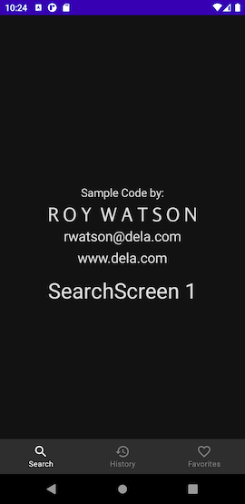

### "AndroidComposeScaffoldNav" example project by:

##       Roy Watson

rwatson@dela.com

www.dela.com

This is a simple example that strips out a lot of generally accepted architectural components and other proclaimed best practices. It is using the minimum of dependencies, frameworks and libraries in order to avoid obscuring the illustration of Android Compose Navigation. I have added comments (beginning with "WATSON") to indicate code that is required achieve the intended goal.

##### Branches:

- "start" branch is the raw templated project created by Android Studio Chipmunk | 2021.2.1 Patch 2. This is supplied for comparison purposes.
- "complete" branch is the example/tutorial application where the "magic"😀 happens. *Since you are reading this then this is the current branch*

##### This example demonstrates/teaches:

- Jetpack Compose
- Jetpack Compose Navigation
- Jetpack Compose Bottom Navigation
- Jetpack Compose Theming including image tinting.
- Using external fonts

##### This example also includes/uses:

- Kotlin

### How to best use this demo:

###### Prerequisite Knowledge, the basic things you need to get started and follow along:

*<u>NavGraph</u>* : Is a class in which you store your desired destinations which are each accessible by an id. ( see https://developer.android.com/reference/androidx/navigation/NavGraph)

<u>*NavController*</u> : This component does a lot of the heavy lifting and housekeeping for us. It manages navigation with a *NavHost* into which you will pass this object (see next discussion and https://developer.android.com/reference/androidx/navigation/NavController). You will specify your desired "destination" composable/Activity/Fragment to this NavController. 

*<u>NavHost</u>* : Is a container to host the current destination specified in the passed in *NavController* which you can change at anytime. (see https://developer.android.com/reference/androidx/navigation/NavHost)

*<u>Scaffold</u>* : Is a compose layout that contains "slots" into which you can insert content such as other composable. One of those slots is for a *bottomBar*. In this demo I insert a *BottomNavigation* composable.

###### Okay let's get started:

The starting point of this app was the template for a new project in Android Studio Chipmunk | 2021.2.1 Patch 2 called “Fragment + ViewModel” and using Kotlin. You can create an empty project based on that template and compare it to this project to discern what needs to be done to get your project started with Compose Navigation and the use of Compose Bottom Navigation. 

The first step was to create the target pages which all reside in the *com.delasystems.androidcomposescaffoldnav.ui.screens* package.Those are the pages we will navigate to and from. 

Next we create a sealed class in the *com.delasystems.androidcomposescaffoldnav.navigation* package. Those are basically the constant names that we will assign to the destinations in our navigation graph. You can easily see that the names corresond to the screen names we created above.

​																							Figure 1.

I put all this together in *MainActivity.kt*. Here we do a number of things. As you can see I separated the code in setContent{} out to a new Composable called *AndroidComposeScaffoldNavApp*. That is not critical, but it is just a way to make the code clearer and easier to interpret. More importantly, we create a *NavController* and a *Scaffold* which contains a slot for a bottomBar in which we will place a BottomNavigation bar. Inside the bottom bar I declared 3 *BottomNavigationItems* each of which represents a selection in the *BottomNavigationBar* ("Search", "History" and "Favorites"). In the Scaffold's content trailing lambda slot I defined a NavHost inside which I define all of the routes and their destinations.  The routes can be called on the NavController to set the contents of the *NavHost*. You can see examples of using these destinations in the target pages, SearchScreen.kt for example. In that page look at the clickable lambda for the *Text* composable. This is replicated in each of the screens.

## License:

    Copyright (C) 2022 Roy Watson
    
    Permission is hereby granted, free of charge, to any person obtaining a copy of this
    software and associated documentation files (the "Software"), to deal in the Software 
    without restriction, including without limitation the rights to use, copy, modify, merge, 
    publish, distribute, sublicense, and/or sell copies of the Software, and to permit persons 
    to whom the Software is furnished to do so, subject to the following conditions:
    
    The above copyright notice and this permission notice shall be included in all copies 
    or substantial portions of the Software.
    
    THE SOFTWARE IS PROVIDED "AS IS", WITHOUT WARRANTY OF ANY KIND, EXPRESS OR IMPLIED, 
    INCLUDING BUT NOT LIMITED TO THE WARRANTIES OF MERCHANTABILITY, FITNESS FOR A PARTICULAR
    PURPOSE AND NONINFRINGEMENT. IN NO EVENT SHALL THE AUTHORS OR COPYRIGHT HOLDERS BE LIABLE
    FOR ANY CLAIM, DAMAGES OR OTHER LIABILITY, WHETHER IN AN ACTION OF CONTRACT,
    TORT OR OTHERWISE, ARISING FROM, OUT OF OR IN CONNECTION WITH THE SOFTWARE OR THE USE
    OR OTHER DEALINGS IN THE SOFTWARE.

